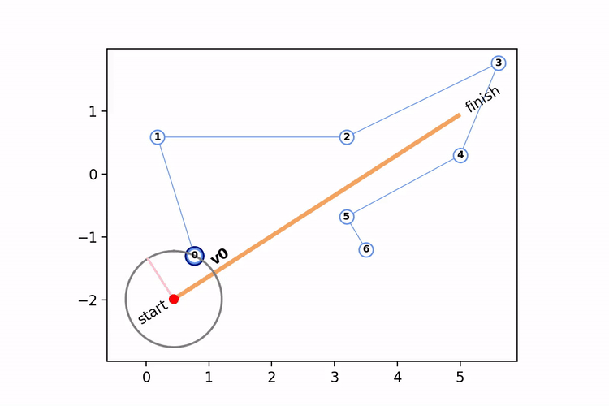

# About
This repository contains code to calculate the continuous directed Hausdorff and average distances between two polylines (A & B) embedded in a standard 2d cartesian coordinate system. 

The average distance is the average of distances between all points on A and the nearest corresponding point on B, where the average is computed as the integral of the distance function divided by the length of A:

$$
\bar{d}_{A \to B} = \int_{a \in A} \left[ \min_{b \in B} d_{a,b} \right] / \mid A \mid
$$

The Hausdorff distance is the maximum of these distances:

$$H_{A \to B} = \max_{a \in A} \left[ \min_{b \in B} \, d_{a,b} \right]$$

# Illustrations
Vectors used in the calculation of each distance metric are illustrated below:

Only a finite number of vectors are shown, but the algorithm computes distances based on a continuous traversal of polyline A. This distinguishes the continuous metrics computed here from approximations that incorporate only vertices of one or both polylines. The image below illustrates differences between the continuous Hausdorff distance $(H_{A \to B})$ and two common approximations: the Hausdorff distance between vertices of both polylines $(H_{v_A \to v_B})$ and from vertices of one polyline to the other polyline $(H_{v_A \to B})$.

To compute the average and Hausdorff distances the algorithm constructs a "distance function" representing the distance from every point on A to the nearest point on B, shown as a dashed black line in the following animation:

This distance function can be captured and used for additional analysis, e.g. to compute the proportion of A within a prescribed distance of B.

# Running the Code
It is assumed that you already have python v.3x installed and know how to 
run basic python modules.

To run this code, you will first need to install the following python packages 
(you are recommended to first clone your python environment):
- rtree (https://www.lfd.uci.edu/~gohlke/pythonlibs/#rtree)
    - download the appropriate one of the following to your python scripts folder:
        - Rtree-0.8.3-cp27-cp27m-win32.whl
        - Rtree-0.8.3-cp27-cp27m-win_amd64.whl
    - open a command-prompt as an administrator
    - navigate to python scripts folder
    - uninstall any previous version, just in case, by entering:
        - pip uninstall rtree
    - install by entering e.g.:
        - pip install Rtree-0.8.3-cp27-cp27m-win32.whl
- sortedcontainers (https://pypi.python.org/pypi/sortedcontainers)
- pyshp (https://pypi.org/project/pyshp/)
- numpy, scipy, matplotlib (these come with most python installations already)

Basic usage is described in the python module **usage.py**.

# Journal Figures
Run the following modules to reconstruct figures and data in the journal article in IJGIS describing the algorithms (below). You should be able to just run each module without altering anything, but explanations and optional parameters to modify (e.g. folders to save results to) are at the top of each module:
- Figure 1: figure_1_hausdorff_comparison.py
- Figure 8: figure_8a_construct_images.py, figure_8b_tile_images.py
- Figure 9: data are contained in the folder “sample_data”.
- Figure 10: figure_10_computational_efficiency_analysis.py
- Figure 11 & Table 3: figure_11_table_3_discrete_comparison.py

You can also view sample animations contained in the animations folder.

# Credits
Details about the algorithms implemented in this code can be found in the following journal article:

> Barry Kronenfeld, Barbara P. Buttenfield, Lawrence V. Stanislawski and Ethan Shavers. Efficient Computation for Continuous Hausdorff and Average Euclidean Distance between Polylines. International Journal of Geographical Information Systems (Accepted: 04-Mar-2026) 

Initial development of the Hausdorff distance computation was performed as a class project
by students in GEO 4910 GIS Programming at Eastern Illinois University in Spring 2021. 

Student Team Members:
- Luke Jansen
- Tanner Jones
- Farouk Olaitan
- Megshi Thakur

The students rigorously constructed and tested the various geometry primitives that remain at the core of the code.