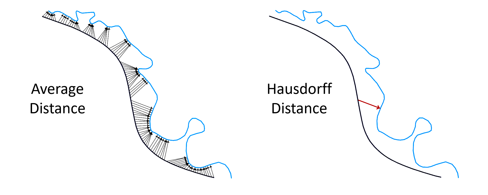

# About
This repository contains code to calculate the continuous directed Hausdorff and average distances between two polylines (A & B) embedded in a standard 2d cartesian coordinate system. 

The Hausdorff distance is the largest gap one would have to cross to get from A to B:

$$H_{A \to B} = \max_{a \in A} \left[ \min_{b \in B} \, d_{a,b} \right]$$

The average distance is the average of distances between all points on A and the nearest corresponding point on B, where the average is computed as the integral of the distance function divided by the length of A:

$$
\bar{d}_{A \to B} = \int_{a \in A} \left[ \min_{b \in B} d_{a,b} \right] / \mid A \mid
$$

These distances are illustrated below:

The directed average distances the average of directional distances from each point on A to the nearest point on B. The Hausdorff distance is the maximum of these directional distances. Note that although the above illustrations show a finite number of distance vectors, the algorithm computes these distances based on a continuous traversal of polyline A. This distinguishes the continuous metrics computed by here from distance metrics that incorporate only vertices of one or both polylines. For example, the figure below shows the difference between the continuous Hausdorff distance ($H_{A \to B}$) from the Hausdorff distance between vertices of both polylines ($H_{v_A \to v_B}$) and from vertices of one polyline to the other polyline in its entirety ($H_{v_A \to B}$):

# Running the Code
It is assumed that you already have python v.3x installed and know how to 
run basic python modules.

To run this code, you will first need to install the following python packages 
(you are recommended to first clone your python environment):
- rtree (https://www.lfd.uci.edu/~gohlke/pythonlibs/#rtree)
    - download the appropriate one of the following to your python scripts folder:
        - Rtree-0.8.3-cp27-cp27m-win32.whl
        - Rtree-0.8.3-cp27-cp27m-win_amd64.whl
    - open a command-prompt as an administrator
    - navigate to python scripts folder
    - uninstall any previous version, just in case, by entering:
        - pip uninstall rtree
    - install by entering e.g.:
        - pip install Rtree-0.8.3-cp27-cp27m-win32.whl
- sortedcontainers (https://pypi.python.org/pypi/sortedcontainers)
- pyshp (https://pypi.org/project/pyshp/)
- numpy, scipy, matplotlib (these come with most python installations already)

Basic usage is described in the python module **usage.py**.

# Reproducing Journal Article Figures
Run the following modules to reconstruct figures and data in the submitted manuscript. 
You should be able to just run each module without altering anything, but explanations 
and optional parameters to modify (e.g. folders to save results to) are at the top
of each module:
- Figure 1: figure_1_hausdorff_comparison.py
- Figure 8: figure_8a_construct_images.py, figure_8b_tile_images.py
- Figure 9: data are contained in the folder “sample_data”.
- Figure 10: figure_10_computational_efficiency_analysis.py
- Figure 11 & Table 3: figure_11_table_3_discrete_comparison.py

You can also view sample animations contained in the animations folder.

# Acknowledgments
Details about the algorithms implemented in this code can be found in our journal article in International Journal of Geographical Information Systems:

> Title: Efficient Computation for Continuous Hausdorff and Average Euclidean Distance between Polylines
> Authors: Barry Kronenfeld, Barbara P. Buttenfield, Lawrence V. Stanislawski and Ethan Shavers
> Accepted: 04-Mar-2026

Initial development of the Hausdorff distance computation was a joint project
of the Spring 2021 semester GEO 4910 GIS Programming class at Eastern Illinois University. 

Student Team Members:
- Luke Jansen
- Tanner Jones
- Farouk Olaitan
- Megshi Thakur

The student team did an amazing job to rigorously create and test the various geometry primitives that remain at the core of the code.